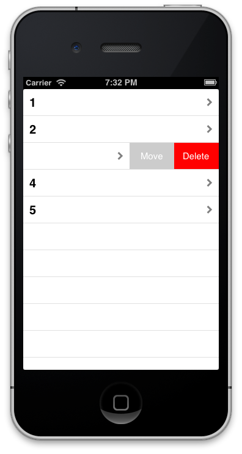
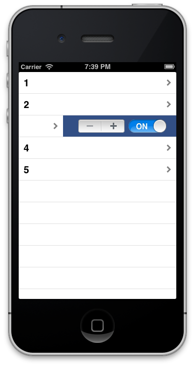

MKSlidingTableViewCell
======================

An iOS 7 style sliding table view cell. By using MKSlidingTableViewCell in your table view you can set any view as the "drawer" view, then set the reveal amount to specify where the scroll view will stick when dragging. Since MKSlidingTableViewCell use a scroll view as the container for the cell's content, as you slide the cell it will track and bounce just as you would expect.  Like the screenshots below, you can mimic iOS 7, or customize it any way you want!




## Usage

### Setup
```objective-c
- (UITableViewCell *)tableView:(UITableView *)tableView cellForRowAtIndexPath:(NSIndexPath *)indexPath
{
    MKSlidingTableViewCell *cell = [tableView dequeueReusableCellWithIdentifier:@"container"];
    UITableViewCell *foregroundCell = [tableView dequeueReusableCellWithIdentifier:@"foreground"];
    UITableViewCell *backgroundCell = [tableView dequeueReusableCellWithIdentifier:@"background"];
    
    cell.foregroundView = foregroundCell;
    cell.drawerView = backgroundCell;
    cell.drawerRevealAmount = 146;
    cell.delegate = self;
    
    //configure cells
    
    return cell;
}
```

### Handling Taps on Cell
```objective-c
- (void)didSelectSlidingTableViewCell:(MKSlidingTableViewCell *)cell
{
    //cell tapped!
}
```

### Notifications
```objective-c
//Add observers
[[NSNotificationCenter defaultCenter] addObserver:self selector:@selector(didRevealDrawerViewForCell:) name:MKDrawerDidOpenNotification object:nil];
[[NSNotificationCenter defaultCenter] addObserver:self selector:@selector(didHideDrawerViewForCell:) name:MKDrawerDidCloseNotification object:nil];

- (void)didRevealDrawerViewForCell:(NSNotification *)notification
{
    MKSlidingTableViewCell *cell = notification.object;
    
    //additional code
}

- (void)didHideDrawerViewForCell:(NSNotification *)notification
{
    MKSlidingTableViewCell *cell = notification.object;
    
    //additional code
}
```

## Credits

MKSlidingTableViewCell was created by [Michael Kirk](https://github.com/PublicStaticVoidMain/) with contributions by [Sam Corder](https://github.com/samus/).

## License

MKSlidingTableViewCell is available under the MIT license. See the LICENSE file for more info.
